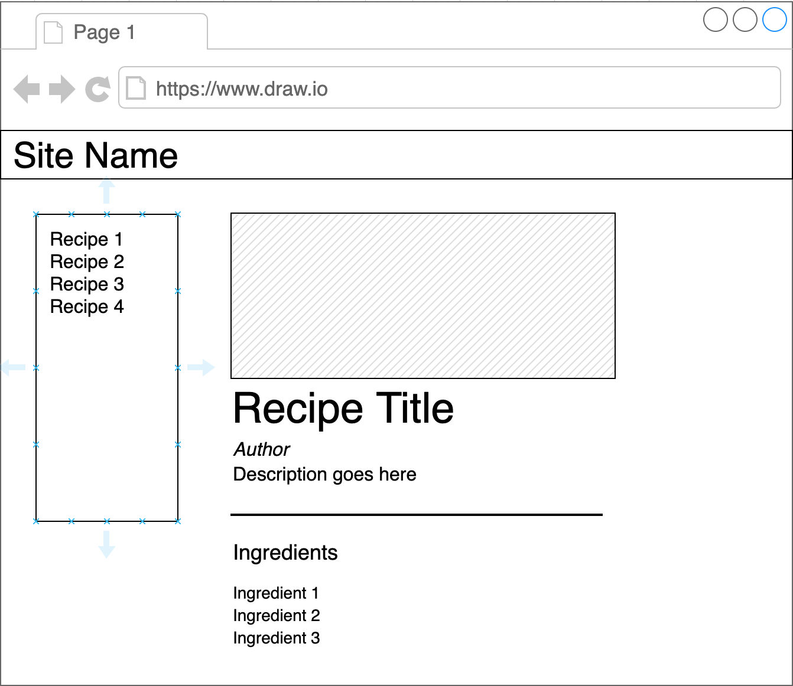
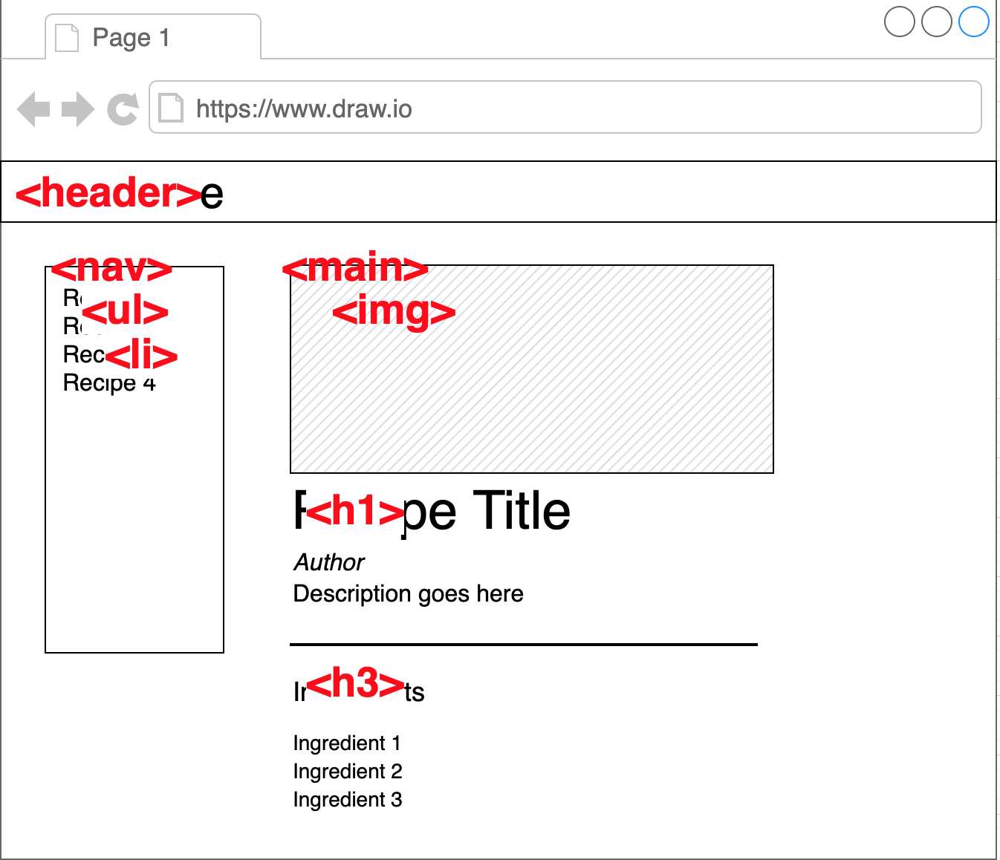
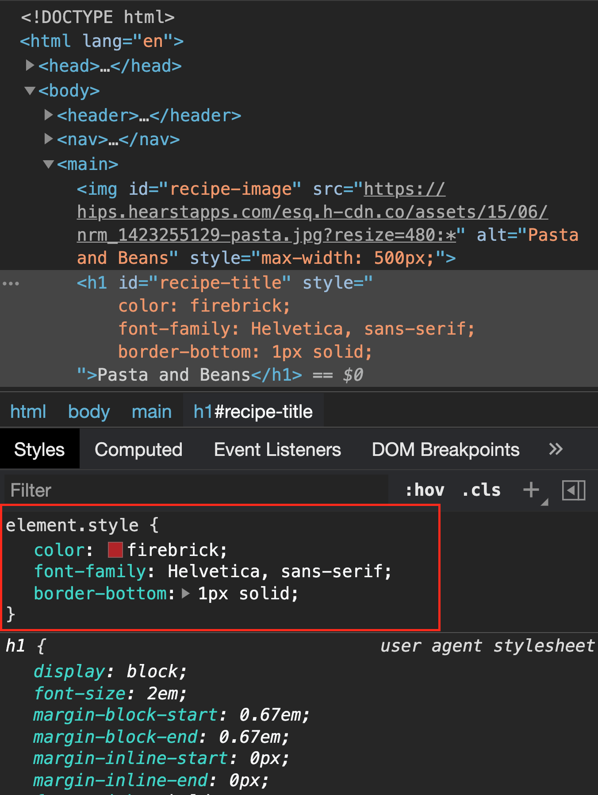

# Phase 3 Project Setup

Our goal is to build out two separate projects: a frontend and a backend. We'll end up with a project structure that looks like this:

```
.
├── <project-name>-frontend (JS)
│   ├── src
│   │   └── index.js
│   ├── styles
│   │   └── main.css
│   └── index.html
└── <project-name>-backend (Rails)
    ├── app
    ├── db
    └── etc (all the other rails code)
```

- Frontend: https://github.com/ihollander/reciplease-frontend
- Backend: https://github.com/ihollander/reciplease-backend

## Frontend Setup

- [ ] [Create a frontend project folder](#file-setup) with HTML, CSS and JS files
- [ ] [Setup git](#git-setup) on your frontend
- [ ] Build out initial wireframe in HTML

### File Setup

You can take the files in the `starter` directory, or follow along with these steps to get your frontend app started.

Create a new folder with the name of your project (like `<project-name>-frontend`) and cd into it.

Create the following files:

```
├── <project-name>-frontend
│   ├── src
│   │   └── index.js
│   ├── styles
│   │   └── main.css
│   └── index.html
```

In your `index.html` file, we'll need something like [this](starter/index.html) to get started (you can type `html:5` in VSCode and Emmet will auto-generate this template).


Make sure to link to your Javascript and CSS files from the `<head>` tag of your HTML file:

```html
  <link rel="stylesheet" href="./styles/main.css">
  <script src="./src/index.js" defer></script>
```

If you're planning on using 3rd-party CSS like [Bootstrap](https://getbootstrap.com/docs/4.3/getting-started/introduction/) or [Semantic](https://semantic-ui.com/), or any [custom fonts](https://developers.google.com/fonts/docs/getting_started), you can also add those links in the `<head>` tag.

### Git Setup

From the root directory of your frontend, run:

```bash
$ git init
$ git add .
$ git commit -m 'Initial commit'
```

This will initialize Git in your frontend folder; add all the files you created to tracking; and make an initial commit.

Then, [create a remote repository on Github](https://docs.github.com/en/free-pro-team@latest/github/getting-started-with-github/create-a-repo) and [add your partner as a collaborator](https://docs.github.com/en/free-pro-team@latest/github/setting-up-and-managing-your-github-user-account/inviting-collaborators-to-a-personal-repository).

### Initial Layout

Based on your initial wireframe, build out the skeleton of your HTML and CSS so your layout matches the wireframe. Don't worry about styling much at this point: just focus on having some [semantic HTML elements](https://www.semrush.com/blog/semantic-html5-guide/) and a general layout, so when you start adding features, you'll have a place in mind for them to go.

Imagine we're building a site like this:



We might end up with a structure that looks like this in our HTML:



We can hard-code some HTML for now to build out our layout:

```html
<header>
  <h2>Site Title</h2>
</header>
<nav>
  <ul>
    <li>Recipe 1</li>
    <li>Recipe 2</li>
    <li>Recipe 3</li>
  </ul>
</nav>
<main>
  
  <h1>Recipe Title</h1>
  <div class="info">
    <h3>Author Name</h3>
    <p>Lorem ipsum dolor sit amet consectetur adipisicing elit. Tempora tempore ipsam a libero aliquam est, maxime officia et quisquam sint neque iusto reprehenderit aliquid dignissimos deserunt odit atque culpa nisi!</p>
  </div>
  <hr />
  <h3>Ingredients</h3>
  <ul>
    <li>Ingredient 1</li>
    <li>Ingredient 2</li>
    <li>Ingredient 3</li>
  </ul>
</main>
```

And add some CSS for positioning using [CSS Grid](https://css-tricks.com/snippets/css/complete-guide-grid/):

```css
body {
  margin: 0;
  padding: 0;
  display: grid;
  grid-template-areas: 
    "header header"
    "nav main";
  grid-template-columns: 300px 1fr;
  grid-template-rows: 80px 1fr;
  row-gap: 10px;
  column-gap: 15px;
}

header {
  grid-area: header;
  border: 2px solid red;
}

main {
  grid-area: main;
  border: 2px solid blue;
}

nav {
  grid-area: nav;
  border: 2px solid green;
}
```

## Backend Setup

- [ ] Generate a [new Rails app](#rails-setup)
- [ ] Create a repository on Github and add your partner as a collaborator
- [ ] [Add gems](#rails-gems) (`rack-cors`, `active_model_serializers`, etc)
- [ ] Configure [CORS](#cors)

### Rails Setup

Here's what we'll run to set up our API:

```bash
rails new <my_app_name> --api --database==postgresql -T
```

_(Replace `<my_app_name>` with the actual name of your project)_

This is what the option flags we're using do:

- `--api`: "Preconfigure smaller stack for API only apps". Don't include code for generating **Views**.
- `--database==postgresql`: Use Postgresql as the database instead of SQLite. Will make it easier to deploy our app.
- `-T`: Skip test files.

> If you forget the `--api` flag you need to add this in your ApplicationController: `skip_before_action :verify_authenticity_token`

Then, run:

```bash
$ rails db:create
```

This will setup your database so you can run migrations in the future.

### Rails Gems

Next, install any gems you'll need; we'll need two at a minimum: `rack-cors` and `active_model_serializers`. 

`rack-cors` is in your Gemfile already; just uncomment that line. Run `bundle install`.

Then, run `bundle add active_model_serializers` to add Active Model Serializers to the app.

If there are other gems you know you'll need (like `faker` or `rest-client`), now's a good time to install them as well.

### CORS

Inside of `config/initializers/cors.rb`, uncomment the following code:

```ruby
Rails.application.config.middleware.insert_before 0, Rack::Cors do
  allow do
    origins '*'

    resource '*',
      headers: :any,
      methods: [:get, :post, :put, :patch, :delete, :options, :head]
  end
end
```

This snippet is from the [documentation for the `rack-cors` gem](https://github.com/cyu/rack-cors).

Inside the `allow` block, this is what the code means: 

- `origins '*'` 
  - allow requests from **all** origins. For now, we will leave the origins open. Later on, we can change this to only allow requests from the address of the frontend repo––localhost:8000 or `www.myapp.com` for example.
- `methods: [:get, :post, :put, :patch, :delete, :options, :head]`
 - allow requests using these HTTP verbs to the API. Read [this](https://www.w3schools.com/tags/ref_httpmethods.asp) if you need a refresher on HTTP methods.

## Building Features

We're going to go through an example of building out a feature for an recipe tracking application. We'll be following the approach of [building vertically](https://github.com/learn-co-curriculum/fewpjs-project-mode-guidelines#build-vertically-not-horizontally) starting with the backend.

Here are some general steps:

- [ ] [Create a branch](#create-a-branch) for the feature you're building
- [ ] Generate a [model and migration](#model-and-migration)
- [ ] [Make seed data](#make-seed-data)
- [ ] Set up [routes and controller](#routes-and-controller)
- [ ] Decide what data your frontend needs, and add a [serializer](#serialization)
- [ ] [Fetch data](#fetch-data) from frontend
- [ ] [Display fetched data](#display-data)
- [ ] Add CSS/styling
- [ ] Refactor
- [ ] Make a pull request and merge in your branch

Our user story: 

> As a user, I can see the first recipe and all of its ingredients

### Create a branch

It's always a good idea to make a new branch any time you're adding code to a project, *especially* when you're working with other people. To create a branch off of the main branch, run `git checkout -b <branch-name>`, where `<branch-name>` is a name that describes your feature:

```bash
$ git checkout -b display-ingredient
```

**Note**: be sure to do this for your frontend and your backend repos!

### Model and Migration

We'll start by generating the model and migration. 

Our schema looks like this:

Recipe -< Ingredients

First, create the Recipe model (since it doesn't depend on Ingredients): 

```bash
$ rails g model recipe name author description image_url
```

Then, make the Ingredient model:

```bash
$ rails g model ingredient name measurement recipe:belongs_to
```

Check the migration files; if the look good:

```bash
$ rails db:migrate
```

We can also add associations to our model files:

```rb
# app/models/recipe.rb
class Recipe < ApplicationRecord
  has_many :ingredients, dependent: :destroy
end
```

### Make Seed Data

In the `db/seeds.rb` file, we'll make a few recipes and ingredients using Faker:

```rb
# db/seeds.rb
puts "🗑 Deleting old recipes..."
Recipe.destroy_all

puts "🍝 Seeding recipes..."
10.times do
  recipe = Recipe.create!(
    name: Faker::Food.dish,
    image_url: "https://hips.hearstapps.com/esq.h-cdn.co/assets/15/06/nrm_1423255129-pasta.jpg?resize=480:*",
    description: Faker::Food.description,
    author: Faker::Artist.name
  )

  5.times do
    Ingredient.create!(
      name: Faker::Food.ingredient,
      measurement: Faker::Food.measurement,
      recipe: recipe
    )
  end
end

puts "🎉 Done!"
```

Then, run `rails db:seed`. Next, run `rails c` and test your models. Can you see all the ingredients? Can you see all the ingredients for one recipe?

### Routes and Controller

Let's use versioning and follow API best practices. We want our namespaced routes our API to look like this: `/api/v1/recipes/1`

For the first deliverable we'll only working need one route: the `show` route.

To set up this routes, we can use the `namespace` method in our `routes.db` file:

```rb
# config/routes.rb
Rails.application.routes.draw do

  namespace :api do
    namespace :v1 do
      resources :recipes, only: [:show]
    end
  end

end
```

If you want to see the routes that this created for us, you can run:

```bash
rails routes
```

Next, we can create a controller for this route:

```bash
$ rails g controller api/v1/recipes
```

In the controller, we want to get one recipe from the database using the ID from the params:

```rb
# app/controllers/api/v1/recipes_serializer.rb
class Api::V1::RecipesController < ApplicationController

  def show
    recipe = Recipe.find(params[:id])
    render json: recipe
  end
  
end
```

Finally, we can test our backend. Run `rails s` and go to the endpoint for your newly created ingredient in the browser. You should see your JSON data returned that looks like this: 

```json
{
  "id": 1,
  "name": "recipe name",
  "author": "recipe author",
  "description": "recipe description",
  "image_url": "https://image.com/something.jpg",
  "created_at": "timestamp",
  "updated_at": "timestamp"
}
```

Make sure to do this before moving on to your next step!

### Serialization

To display the data about each recipe in the frontend, we'll want data that looks like this (instead of what we saw before):

```json
{
  "id": 1,
  "name": "recipe name",
  "author": "recipe author",
  "description": "recipe description",
  "imageUrl": "https://image.com/something.jpg",
  "ingredients": [
    {
      "id": 1,
      "name": "ingredient name",
      "measurement": "amount"
    },
    {
      "id": 2,
      "name": "ingredient name",
      "measurement": "amount"
    }
  ]
}
```

We can use Active Model Serializers to make this happen.

First, we'll need to create the serializers:

```bash
$ rails g serializer recipe
$ rails g serializer ingredient
```

Then, in the serializer, set up the attributes we need in our JSON data:


```rb
# app/serializers/recipe_serializer.rb
class RecipeSerializer < ActiveModel::Serializer
  attributes :"," :name, :author, :image_url, :description
  has_many :ingredients
end
```

```rb
# app/serializers/ingredient_serializer.rb
class IngredientSerializer < ActiveModel::Serializer
  attributes :id, :name, :measurement
end
```

We can also customize the serializer to use camelCase instead of snake_case. Create a new file under `/config/initializers` named `active_model_serializers.rb`, and in that file, add:

```rb
ActiveModelSerializers.config.key_transform = :camel_lower
```

Now, run your server and check out the output. It should match the JSON structure we are looking for.

Time for the frontend!

### Fetch Data

Before trying to display anything, we just want to get a fetch set up and make sure our frontend and backend can communicate.

```js
fetch("http://localhost:3000/api/v1/recipes/1")
  .then(r => r.json())
  .then(console.log)
```

Since this is a GET request, it's pretty straightforward; if we were doing a POST request or PATCH request, this would be a good opportunity to hard-code some data in your request to check that it's working:

```js
fetch("http://localhost:3000/api/v1/recipes/1", {
  method: "PATCH",
  headers: {
    "Content-Type": "application/json"
  },
  body: JSON.stringify({ 
    name: "updated name"
  })
})
  .then(r => r.json())
  .then(console.log)
```

Now that we're confident the fetch works, we can move on to the display logic.

### Display Data

Since we've gone the trouble of setting up our frontend layout already, we can more easily get started on the rendering logic.

First, we need to find where on the page our data will be displayed. Let's use IDs to make it easier to access those elements from Javascript.

```html
<main>
  
  <h1 id="recipe-title">Recipe Title</h1>
  <div id="recipe-info">
    <h3>Author Name</h3>
    <p>Lorem ipsum dolor sit amet consectetur adipisicing elit. Tempora tempore ipsam a libero aliquam est, maxime officia et quisquam sint neque iusto reprehenderit aliquid dignissimos deserunt odit atque culpa nisi!</p>
  </div>
  <hr />
  <h3>Ingredients</h3>
  <ul id="ingredients-list">
    <li>Ingredient 1</li>
    <li>Ingredient 2</li>
    <li>Ingredient 3</li>
  </ul>
</main>
```

Next we can write out some functions to take the data from the backend and display it:

```js
const renderIngredient = (ingredient, parentElement) => {
  const li = document.createElement("li")
  li.textContent = `${ingredient.measurement} ${ingredient.name}`
  
  parentElement.append(li)
}

const renderRecipe = recipe => {
  const img = document.querySelector("#recipe-image")
  img.src = recipe.imageUrl
  img.alt = recipe.name

  const title = document.querySelector("#recipe-title")
  title.textContent = recipe.name

  const author = document.querySelector("#recipe-info h3")
  author.textContent = recipe.author

  const description = document.querySelector("#recipe-info p")
  description.textContent = recipe.description

  const ingredientList = document.querySelector("#ingredients-list")
  ingredientList.innerHTML = ""
  recipe.ingredients.forEach(ingredient => {
    renderIngredient(ingredient, ingredientList)
  })
}
```

Now, to hook it up with the fetch:

```js
fetch("http://localhost:3000/api/v1/recipes/1")
  .then(r => r.json())
  .then(renderRecipe)
```

### Styling

At this point, the functionality for your user story is working - congrats! Now's a good time to add a little polish with CSS. Think about what you want the elements to look like, then try this workflow:

- Open the Dev Tools, and inspect the element you're trying to style
- In the Dev Tools, apply styling to the element to experiment until you're happy with the look
- Copy the styles, and add them to your CSS file (if you need to add a class or an ID to your element, now's a good time)



### Refactor

Now's a great time to review the code you've written with your partner! Before moving on to the next feature, take some time with your partner to refactor your code.

Think about:

- **Code organization**: will it be easy to find the code you've written when you need to make changes later?
- **Readability**: does the code effectively document what its doing, or do you need additional comments to make it clear when you're reading the code later?
- **Formatting**: is your code indented well, and following Javascript conventions for variable names?
- **Function responsibility**: can you break out your functions to remove repetitive code, or to break up the functionality among multiple functions to keep any one function from growing too large?

For example, I might refactor our existing code to use some OOP design patterns; or create separate files for different areas of concern (fetch vs DOM manipulation); or add comments to organize my code.

### Merging Changes

Now that your feature is done, it's time to merge! 

First, make sure to sync your branch with your partner's code:

```bash
$ git pull origin main
```

This will fast-forward any changes from the main branch onto your branch, so you can see any merge conflicts and fix them before finalizing your code.

Then, make sure to add a commit, then push up your branch:

```bash
$ git add .
$ git commit -m 'Added detail view'
$ git push origin display-ingredient
```

On Github, make a pull request and then merge your code.

Then, from the main branch, `git pull` to fetch and merge the latest code from the remote repository. You can also delete the feature branch once you've successfully merged it in.

```bash
$ git checkout main
$ git pull 
$ git branch -D display-ingredient
```